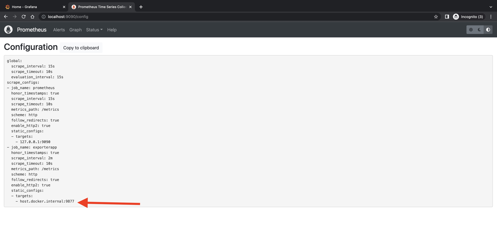
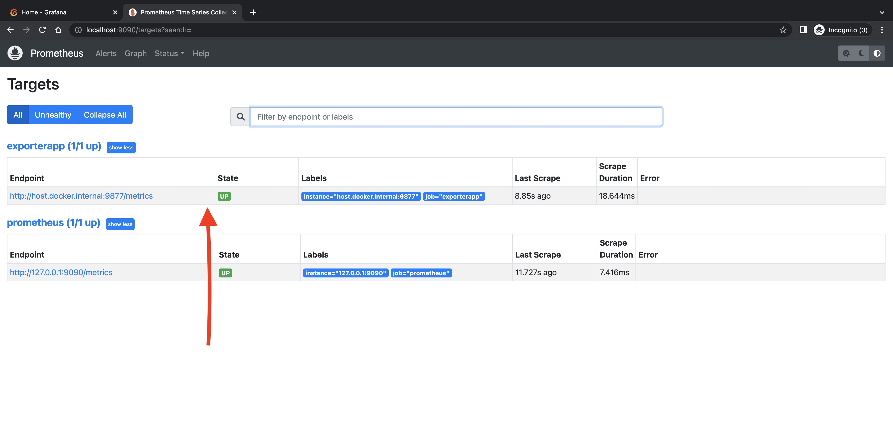
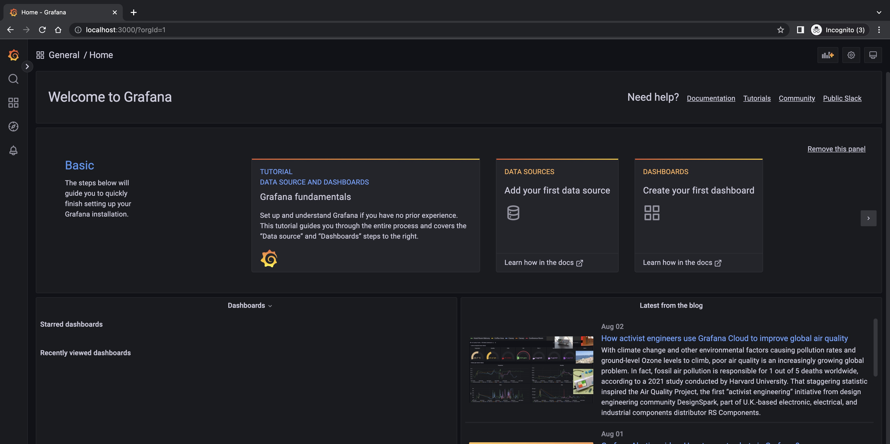
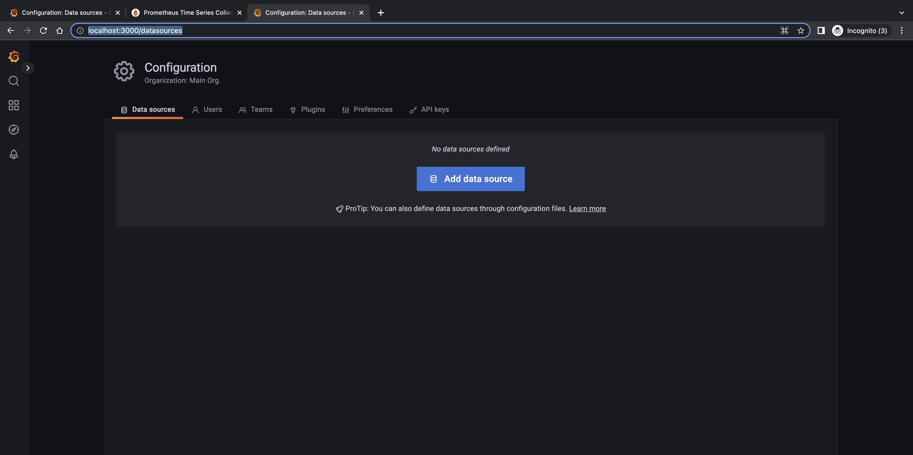
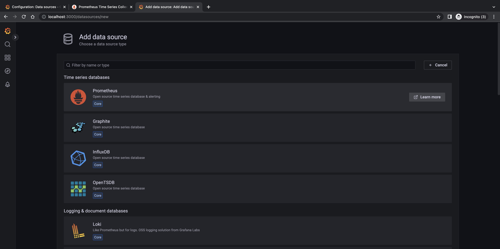
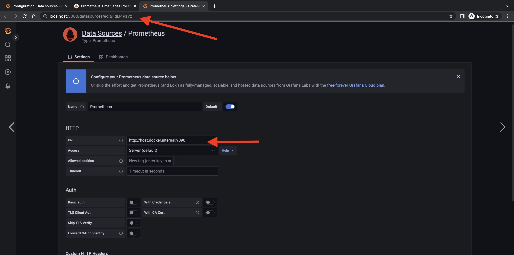
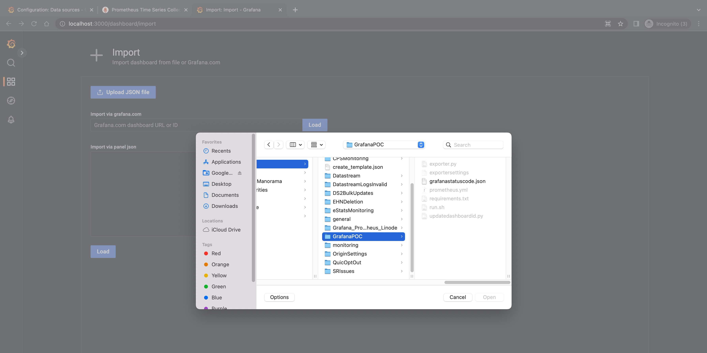
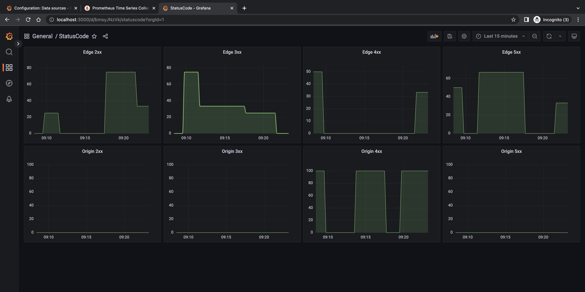

# HTTP Status Code Distribution
One of the common challenges for Akamai Customers is to monitor the traffic of their websites in real time. Datastream is Akamai's real time data export offering to the favorite destinations of customers. If the customer is not really in the need of real time logs and are okay with a delay of 2 mins, then eStats data would be a good consumption. This estats endpoint returns HTTP status codes distribution statistics from delivering a URL or CP code based on the nine-second traffic sample from the last two minutes.
Feel free to go through the [API endpoint](https://techdocs.akamai.com/edge-diagnostics/reference/post-estats).

- This POC is aimed at how to quickly setup [Grafana](https://grafana.com/) Dashboards for monitoring HTTP Status Code Distribution

### Proposed Workflow


### Prerequisite
- Create an API Client with Read-write access to EdgeDiagnostics Endpoint. Once you create an API client you would have the credentials like shown below and save it in ~/.edgerc file or any file of your choice. Detailed steps can be found [here](https://techdocs.akamai.com/developer/docs/set-up-authentication-credentials).
```
[default] 
client_secret = abcdEcSnaAtasdas123FNkBxy456z25qx9Yp5CPUxlEfQeTDkfh4QA=I 
host = akab-lmn789nsss2k53w7asdasdqrs10cxy-nfkxaa4lfk3kd6ym.luna.akamaiapis.net 
access_token = akab-zyx987asdasxa6osbli4k-e7jf5ikib5jknes3
Client_token = akab-nomadoflavjuc4422-fa2xznerxrm3teg7
```

- Installation of Docker Desktop : Promethes and Grafana will be run on docker containers. So to run the docker images, you need to install the Docker Desktop. Steps can be found [here](https://www.docker.com/products/docker-desktop/)

- Python3 [Installation](https://www.python.org/downloads/) 

### Configure the Exporter
```
[Exporter]
polling_interval = 120
exporter_port = 9877

[Akamai]
edgerclocation = /Users/apadmana/.edgerc
cpcode = 1209788
deliverynetwork = STANDARD_TLS
accountSwitchKey = B-C-1IE2OH8:1-2RBL
```
If you are an Akamai customer then you can leave accountSwitchKey as blank. Rest everything needs to be filled up as per your need.
polling_interval denotes the frequency of pulling the data from Akamai estats.


### Run the Exporter
```
[~/GrafanaPOC]$:python exporter.py 
HTTP Exporter Server is Running on Port 9877
```

### Configure and Run the Prometheus Server
An official docker image of Prometheus is pulled and a prometheus server will be running on port 9090. Prometheus.yml contains the exporter details.
```
[~/GrafanaPOC]$:docker run -d --name prometheus -p 9090:9090 -v /Users/apadmana/GrafanaPOC/prometheus.yml:/etc/prometheus/prometheus.yml prom/prometheus --config.file=/etc/prometheus/prometheus.yml
cb3b6489e62f7ac5b35c6128b37bcdcbc0a1880d09e14810c9cf47e89677b875
[~/GrafanaPOC]$
```

- You can confirm the same by clicking on http://localhost:9090/config


- You can also check if the exporter is working fine by a health check of the target at http://localhost:9090/targets



### Configure and Run the Grafana Server
An official docker image of Grafana is pulled and a grafana server will be running on port 3000. 
```
[~/GrafanaPOC]$:docker run -d --name grafana -p 3000:3000 grafana/grafana
ec7cd6b921d8fe4e794ce18492c4f80caa54c62a114f66d744ab1b204cd62e4a
[~/GrafanaPOC]$
```

- Login to Grafana at http://localhost:3000/config


- Homepage


- Click on Add your first data source or http://localhost:3000/datasources


- Add data source


- Configuring Prometheus datasource in Grafana and Copy the datasource Id from the url FqlJ4PzVz


- Update the Dashboard json with the Datasource Id
```
[~/GrafanaPOC]$:python updatedashboardid.py -d FqlJ4PzVz
[~/GrafanaPOC]$:
```

- Import dashboard at http://localhost:3000/dashboard/import


- Grafana Visualization will be ready in no time

